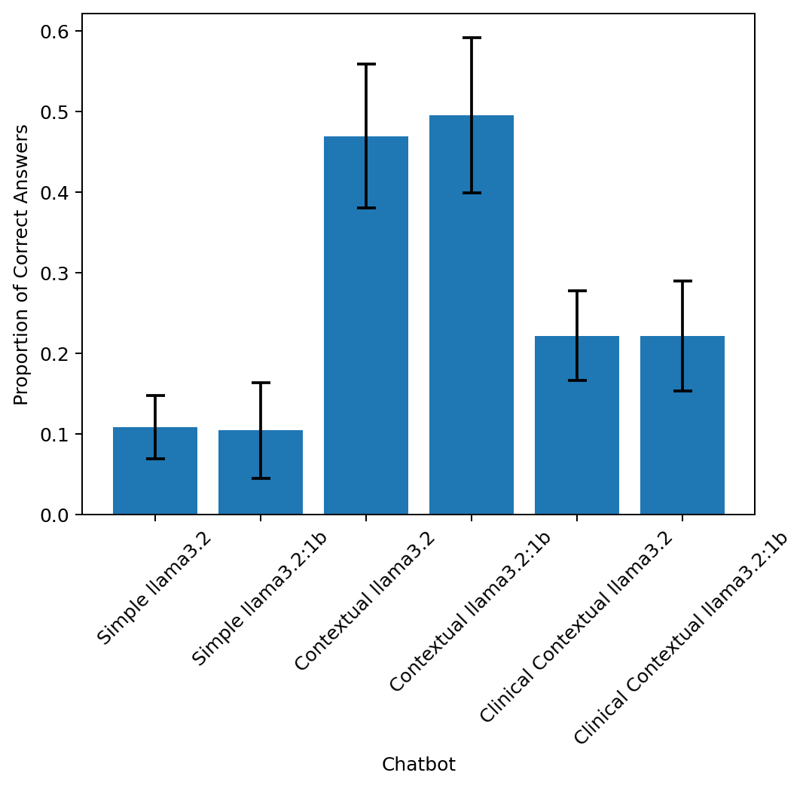
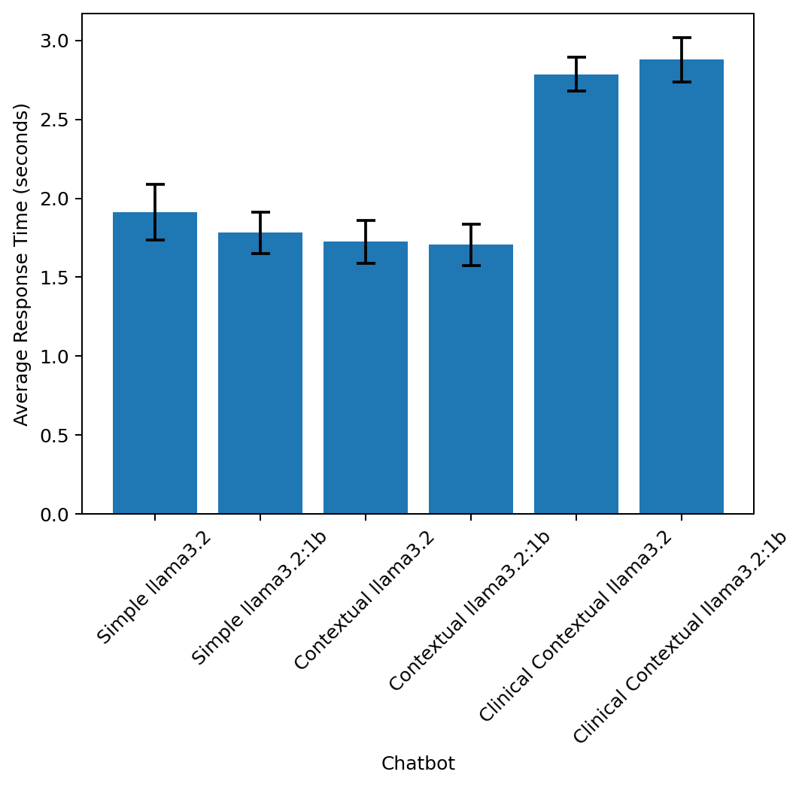

# HER-2 Chatbot Prototype

## Overview

This repository contains a question-answering (Q/A) chatbot prototype developed for understanding and answering questions about the 1987 Science publication:

**"Human breast cancer: correlation of relapse and survival with amplification of the HER-2/neu oncogene"** by Dennis J. Slamon et al.

The system implements and compares three chatbot architectures:

- **SimpleChatBot**: A baseline LLM that answers questions without access to paper context.
- **ContextualChatBot**: Implements standard RAG (Retrieval-Augmented Generation) by embedding and retrieving chunks from the HER2 paper.
- **ClinicalContextualChatBot**: Incorporates clinical knowledge embeddings into the RAG retrieval step to experiment with domain-specific enhancement.

---

## Installation and Setup

### 1. Clone Repository

```bash
git clone https://github.com/nanda-yeruva/QA-chatbot.git
cd QA-chatbot
```

### 2. Create Virtual Environment

```bash
python3 -m venv venv
source venv/bin/activate
```

### 3. Install Dependencies

```bash
pip install --upgrade pip
pip install -r requirements.txt
```

---

## Running the Chatbot

### 1. Start Ollama LLM Server

```bash
ollama serve
```

### 2. Build Vector Database

Make sure `HER2_paper_stripped.pdf` is located under `reference_docs/`.

```bash
python src/vector_builder.py
```

### 3. Run the Chatbot

You can choose the chatbot configuration (simple, contextual, clinical) within `src/qa_assistant.py`.

```bash
python src/qa_assistant.py
```

You can run this locally and start asking questions related to the Slamon et al. (1987) HER2 breast cancer study. The chatbot retrieves context from the paper and generates relevant, research-grounded answers using an open-source LLM.

### 4. Evaluate All Chatbot Versions

This generates accuracy and latency plots under project root.

```bash
python src/qa_evaluator.py
```

---

## Folder Structure

```
QA-chatbot/
├── src/
│   ├── vector_builder.py
│   ├── qa_assistant.py
│   └── qa_evaluator.py
├── reference_docs/
│   ├── HER2_paper_stripped.pdf
│   ├── factual_questions.csv
│   ├── full_h_embed_hms.npy
│   └── new_node_map_df.csv
├── factual_accuracy_plot.png
├── response_time_plot.png
├── requirements.txt
└── README.md
```

---

## Evaluation Methodology

### Accuracy

- Metric: Fuzzy string matching using partial ratio
- Based on 25 manually curated factual Q&A pairs from the HER2 publication

### Latency

- Average response time over 25 consistent questions
- Compared across 3 chatbot architectures × 2 model sizes

---

## Results

### Accuracy Chart



### Latency Chart



- **ContextualChatBot** using standard RAG shows the highest accuracy.
- **ClinicalContextualChatBot** improves slightly over the base LLM but underperforms compared to standard RAG.
- **Smaller models (llama3.2:1b)** were faster and sometimes more accurate than their larger counterparts.

---

## Embedding Strategy

### Standard RAG

- Splits the HER2 paper into 500-word chunks with 50-word overlap
- Uses `all-mpnet-base-v2` from `sentence-transformers` to generate embeddings
- Stores in a Chroma vector database

### Clinical RAG

- Leverages clinical word embeddings from Harvard MIMS
- Embedding is computed as a TF-weighted average of token embeddings
- Retrieval is based on cosine similarity over those averaged vectors

---

## Assumptions & Limitations

- Built for **local use only** using Ollama; no cloud APIs involved
- HER2 PDF used has OCR issues — could be improved using better scanned copies
- Clinical embeddings integration used a basic strategy — future work could include sentence-level fine-tuning

---

# Clinical Knowledge Embeddings: Assignment Questions

This section provides a detailed explanation of the clinical knowledge embeddings paper and how it applies to the HER-2 Chatbot prototype and broader healthcare use cases like Humana.

---

## 1. What are 3 takeaways from the clinical knowledge embeddings paper?

### a. Cross-Institutional Generalization through Unified Embeddings

Clinical codes (like ICD, SNOMED, or CPT) are often used differently across hospitals, leading to interoperability issues in multi-site deployments of AI systems. This paper presents a novel way to learn **unified clinical embeddings** that generalize across healthcare institutions.

- These embeddings are derived from structured knowledge graphs (e.g., SNOMED-CT), not patient records.
- Clinicians from Boston and Israel evaluated the embeddings and showed consistent interpretation of concept relevance, confirming their **generalization power**.

### b. Retain Predictive Clinical Signal

The embeddings retain the **predictive strength needed for real-world applications**, such as risk stratification.

- The authors used them to compute clinical risk scores.
- For example, among male patients with chronic kidney disease, the top 20% of scores had 27% lower survival compared to the bottom 20%.
- This shows that **semantic unification does not sacrifice predictive value**.

### c. Privacy-Preserving Learning with No Patient Data

Unlike traditional deep learning methods that require access to Electronic Health Records (EHRs), these embeddings are trained using curated knowledge graphs, not raw patient data.

- This makes them **scalable, secure, and regulation-friendly**, ideal for enterprise healthcare companies.
- Such an approach helps avoid ethical and legal risks related to patient data access.

---

## 2. Why is this research important for Humana?

### a. Standardizing Clinical Data Across Systems

Humana works with healthcare data from multiple providers and hospitals, each with their own data formats and terminologies. These embeddings offer a robust way to **normalize clinical data across disparate sources**, which is vital for building unified patient profiles and analytics systems.

### b. Enabling Safer, More Trustworthy AI

By using embeddings built on top of clinician-validated knowledge (instead of opaque black-box models), Humana can ensure that its AI systems provide **trustworthy, explainable, and safer outputs**. This is essential in medical applications such as:

- Virtual care assistants
- Benefits and claims review automation
- Clinical decision support

### c. Compliance and Governance

These embeddings align closely with **regulatory best practices** since they are derived from public, transparent sources like SNOMED-CT. Humana can:

- Trace model decisions to ontology terms
- Demonstrate auditability to regulators (e.g., CMS)
- Avoid legal and compliance risks around opaque AI

---

## 3. How can you include this research into your Q/A chatbot?

### Implementation Summary:

- I loaded the pretrained embedding matrix (`full_h_embed_hms.npy`) and the term-to-index mapping (`new_node_map_df.csv`) provided by the Harvard MIMS GitHub repository.
- Built a custom vectorizer that tokenized HER2 paper chunks and computed a **term-frequency weighted average** of medical concept embeddings for each chunk.
- Used cosine similarity between user question vector and paper chunk vectors for context retrieval in RAG.

### Strengths:

- Created a **clinically-aware retrieval engine** that uses domain semantics rather than just generic sentence embeddings.
- Preserved alignment with healthcare-specific concepts, which is important in safety-critical systems.

### Limitations:

- Clinical embeddings were at the **word level**, which made sentence-level matching less precise.
- HER2 paper uses rich biomedical phrases that are not directly represented in the embedding vocabulary.
- Retrieval quality was lower than standard transformer-based RAG using `all-mpnet-base-v2`.

### Suggested Improvements:

- Use sentence transformers fine-tuned on biomedical QA datasets like PubMedQA or BioASQ.
- Apply graph-based sentence encoders that leverage the underlying SNOMED structure.
- Use multi-view retrieval: fallback to standard RAG if clinical match fails.

---

This work demonstrates the promise and current limitations of domain-specific retrieval using clinical embeddings. Future iterations could blend general LLM retrieval with ontology-aware layers for better accuracy and trust.

---

## Future Improvements

- Integrate OCR post-processing to clean PDF text
- Use FastAPI or Streamlit for a web-based chatbot frontend
- Fine-tune sentence transformer with biomedical corpora
- Add Docker packaging for full pipeline reproducibility
